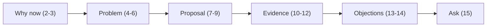
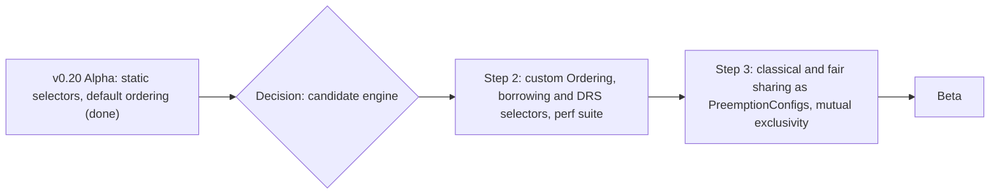
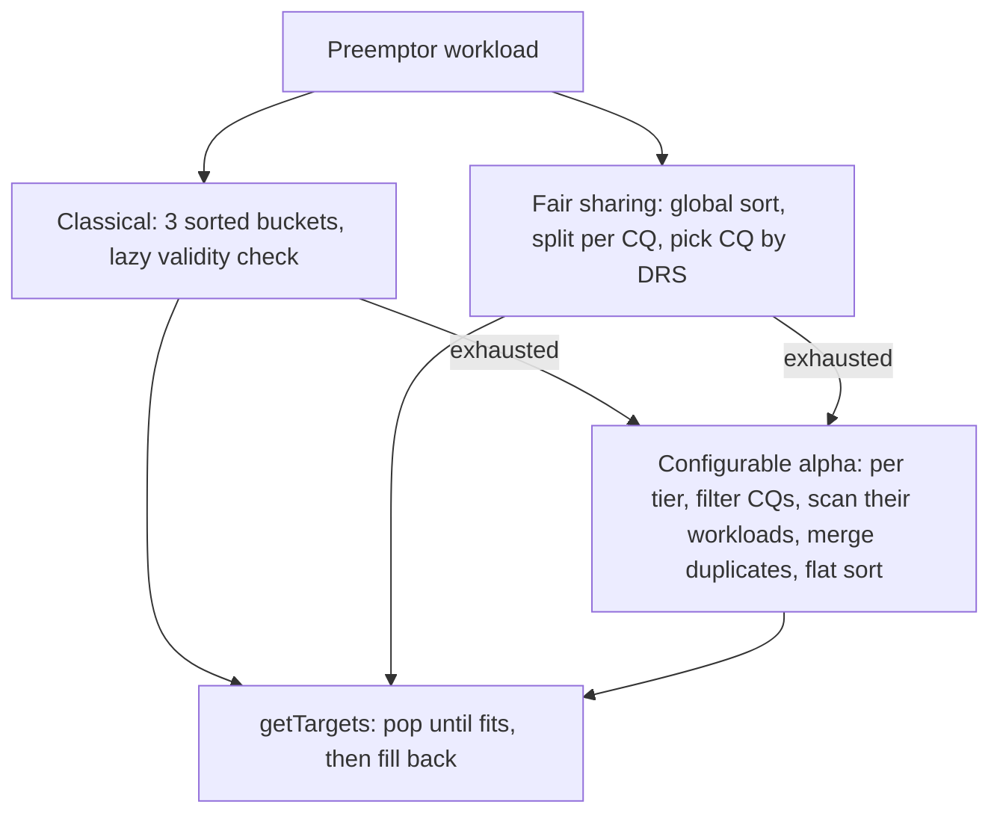
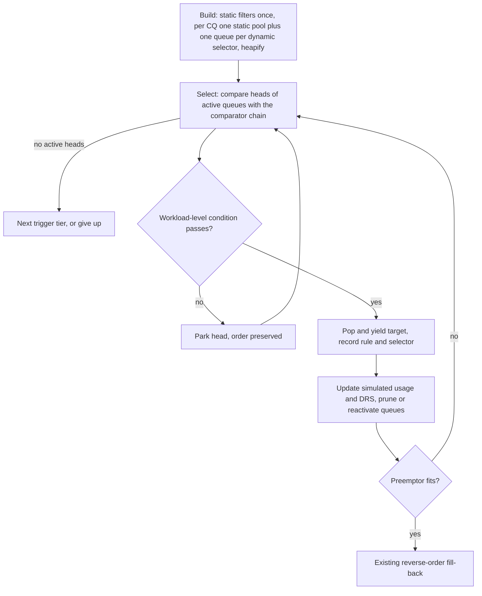
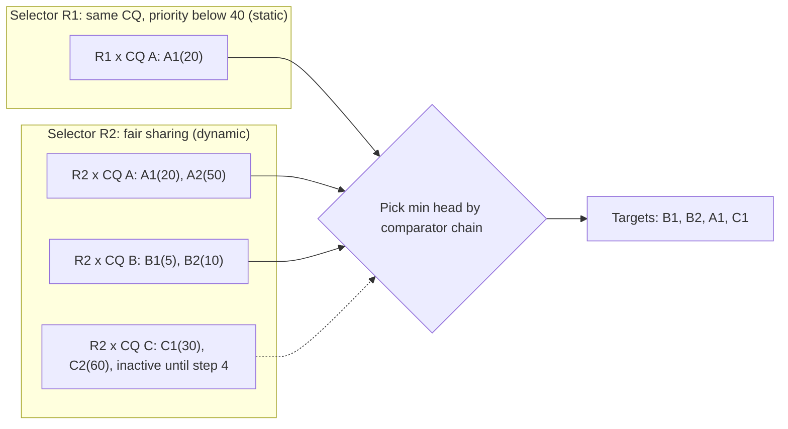
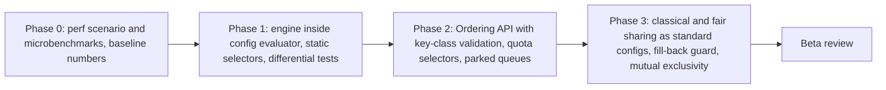

# Presentation layout: per-(Selector, ClusterQueue) priority queues for configurable preemption

**Audience:** Kueue maintainers and KEP-13396 reviewers
**Slot:** about 21 minutes plus Q&A. 15 main slides and 8 backup slides.
**What we want them to agree to:** per-(Selector, ClusterQueue) priority queues become the way configurable preemption generates and orders candidates in [KEP-13396](file:///usr/local/google/home/nilsachy/kueue/keps/13396-configurable-preemptions/README.md) Step 2 (custom `Ordering` plus borrowing- and DRS-aware selectors). They also approve a prototype behind a feature gate and an agreed benchmark plan.
**Starting point:** [FUTURE_WORK.md, "[Optimized] Dynamically Adjusted Candidate Generation"](file:///usr/local/google/home/nilsachy/kueue/keps/13396-configurable-preemptions/FUTURE_WORK.md#L241-L394). The deck adds refinements to it, marked ★.



**Slide conventions**
- Each slide title states the conclusion, so the titles alone tell the story.
- One idea per slide. Put code references in a small footer, as GitHub permalinks pinned to a commit.
- Use the same A/B/C example on slides 5, 7 and 8.

## Deck at a glance

| # | Slide title | Time |
|---|---|---|
| 1 | Custom candidate ordering that scales | 0:30 |
| 2 | TL;DR: one queue per (Selector, ClusterQueue), and four decisions | 1:00 |
| 3 | Every Beta gate depends on how candidates are generated | 1:00 |
| 4 | Today: three candidate paths, one hard-coded order | 1:30 |
| 5 | Dynamic quota state breaks "sort once" | 2:00 |
| 6 | The obvious fixes are either wrong or quadratic | 1:30 |
| 7 | Proposal: fixed order inside each queue, dynamic state handled per queue | 2:00 |
| 8 | Worked example: the candidate a sorted list misses | 2:00 |
| 9 | One rule keeps it correct: the ordering-key contract | 1:30 |
| 10 | Not a new idea: Kueue already does this three times | 1:30 |
| 11 | Performance: no change for static configs, no quadratic blowups for dynamic ones | 1:30 |
| 12 | Correctness, determinism, and a path to the open Beta blockers | 1:30 |
| 13 | Alternatives considered | 1:00 |
| 14 | Risks and mitigations | 1:00 |
| 15 | Decisions requested and next steps | 1:00 |

> [!TIP]
> For a 15-minute slot, move slides 10 and 13 to backup and shorten slides 4 and 6.

---

## Main slides

### 1. Custom candidate ordering that scales

- **Subtitle:** Per-(Selector, ClusterQueue) priority queues as the candidate engine for KEP-13396 Step 2 and Beta.
- **On slide:** presenter, date, links to the KEP README and FUTURE_WORK.
- **Visual:** a small grid of queues (selectors × ClusterQueues) with their heads highlighted. This picture comes back on slide 7.
- **Speaker notes:** "This talk is about how configurable preemption chooses and orders candidates once the order is configurable and selectors depend on quota state. FUTURE_WORK already sketches the design. I'd like us to commit to it, with a few refinements, before Step 2 code lands."

### 2. TL;DR: one queue per (Selector, ClusterQueue), and four decisions

**Key message:** In Step 2, which candidates are eligible and in what order can change after every simulated preemption. Per-(Selector, ClusterQueue) priority queues handle this correctly in roughly O(n log n), and they generalize code Kueue already runs.

**On slide:**
- **Problem:** borrowing- and DRS-aware selectors, and DRS-based ordering keys, make a list that was sorted once go stale.
- **Proposal:** one priority queue per (CandidateSelector, ClusterQueue); static selectors share one queue per ClusterQueue. Order inside each queue never changes during evaluation. Dynamic state is tracked per queue. At each step, take the best queue head.
- **Why it's safe:** it generalizes fair sharing's per-ClusterQueue ordering. Phase 1 keeps today's order exactly, and an unset `ordering` keeps it afterwards (decision 2). It ships behind the existing `ConfigurablePreemptions` alpha gate.
- **Ask box:** ☐ use it as the Step 2 engine · ☐ adopt the ordering-key contract and keep today's order as the default · ☐ approve the prototype and benchmark plan · ☐ solve the [#14122](https://github.com/kubernetes-sigs/kueue/issues/14122) / [#14543](https://github.com/kubernetes-sigs/kueue/issues/14543) bug classes inside it.

**Visual:** three bullets on the left, the ask box on the right. The ask box returns on slide 15.

**Speaker notes:** Say the ask first, so the rest of the talk is evidence for it. Stress "generalizes, not invents": slide 10 maps each piece to existing code.

### 3. Every Beta gate depends on how candidates are generated

**Key message:** Step 2 and all the Beta criteria change how candidates are generated and ordered. We should choose the engine now, not rewrite it at Beta.

**On slide:**
- **Done (v0.20, alpha, off by default):** `PreemptionConfig` with static selectors (scope, ClusterQueue and workload labels, numeric labels, priority). It uses the default ordering, and its candidates come after the classical or fair-sharing ones.
- **Next, KEP Step 2:** fair sharing, borrowing-based rules, custom candidate ordering, and a preemption performance test suite.
- **Beta gates:** feature parity with classical and fair sharing · mutual exclusivity ([#15893](https://github.com/kubernetes-sigs/kueue/issues/15893)) · "no significant performance regression" · open challenges #14122 and #14543 addressed.

**Visual:**


**Speaker notes:** The KEP itself puts this design off to Future Work ([Integration](file:///usr/local/google/home/nilsachy/kueue/keps/13396-configurable-preemptions/README.md#L861-L865)). Its Beta criteria, however, require the open challenges to be fixed and no performance regression ([Beta](file:///usr/local/google/home/nilsachy/kueue/keps/13396-configurable-preemptions/README.md#L959-L966), [Implementation History](file:///usr/local/google/home/nilsachy/kueue/keps/13396-configurable-preemptions/README.md#L988-L1018)). If Step 2 adds dynamic logic on top of the flat sort, we'll rewrite it for Beta anyway.

### 4. Today: three candidate paths, one hard-coded order

**Key message:** Candidate ordering lives in three code paths. All of them hard-code `CandidatesOrdering`, and they run one after another, so there's no single place where a user-defined order could apply.

**On slide (three columns):**
- **Classical:** three buckets (hierarchy, priority, same ClusterQueue), each sorted. Validity is checked lazily on `Next()`.
- **Fair sharing:** one global sort, then a split per ClusterQueue. Each step picks the ClusterQueue with the highest DRS and prunes ClusterQueues and cohorts.
- **Configurable (alpha):** for each trigger tier, checks every ClusterQueue against each selector's ClusterQueue filters (scope, `clusterQueueSelector`), then scans workloads only in the ClusterQueues that pass. Merges duplicates by UID, then does one flat sort per tier. These candidates are used only after the strategy's own candidates run out.
- **Bottom strip:** the fixed order is evicted → other ClusterQueue first → (AFS) higher LocalQueue usage first → lower priority → more recently admitted → UID. The candidates actually come out as [strategy] ++ [Always tier] ++ [InsufficientQuota tier] ++ [Topology tier].

**Visual:**


**Speaker notes:** This slide is factual, not critical: the alpha deliberately kept changes small. The point is that the order is fixed and split into segments.

**Sources:** [`CandidatesOrdering`](file:///usr/local/google/home/nilsachy/kueue/pkg/scheduler/preemption/common/ordering.go#L36-L85) · [`NewCandidateIterator`](file:///usr/local/google/home/nilsachy/kueue/pkg/scheduler/preemption/classical/candidate_generator.go#L73-L117) · [fair sharing: global sort](file:///usr/local/google/home/nilsachy/kueue/pkg/scheduler/preemption/fair_strategy.go#L46-L50) · [`orderedCandidates`](file:///usr/local/google/home/nilsachy/kueue/pkg/scheduler/preemption/config/evaluator.go#L218-L239) · [`addMatchingCandidates`](file:///usr/local/google/home/nilsachy/kueue/pkg/scheduler/preemption/config/evaluator.go#L293-L316) · [ClusterQueue filters](file:///usr/local/google/home/nilsachy/kueue/pkg/scheduler/preemption/config/filters/factory.go#L69-L73) · configurable candidates come after [classical](file:///usr/local/google/home/nilsachy/kueue/pkg/scheduler/preemption/classical_strategy.go#L85-L104) and after [fair sharing](file:///usr/local/google/home/nilsachy/kueue/pkg/scheduler/preemption/fair_strategy.go#L113-L122).

### 5. Dynamic quota state breaks "sort once"

**Key message:** Once selectors and ordering keys depend on simulated quota state, a candidate can become ineligible, become eligible again, and the order can change after every pop.

**On slide:**

| Step 2 feature | Effect after each simulated preemption | Example |
|---|---|---|
| `quota: BorrowingCapacityFromPreemptor` | Candidates become **ineligible** | CQ B borrows 1 unit from CQ A. After one B workload is popped, the rest of B is no longer eligible. |
| `quota: DRSLessThan…` (fair sharing) | Candidates become **eligible again** | Popping a workload from the preemptor's own CQ lowers that CQ's share, so workloads in CQ C become fair targets. This is the [#14122](https://github.com/kubernetes-sigs/kueue/issues/14122) pattern. |
| `ordering: ClusterQueueDRS` and similar keys | The order **across CQs** changes | Shares change after every pop. |

- **Callout:** a list sorted once is out of date after the first pop. A cursor that only moves forward can't go back to candidates it skipped.

**Visual:** a before/after bar pair. CQ A and CQ B each have nominal quota 5, and B uses 6. After popping one of B's workloads, the remaining B workloads turn grey.

**Speaker notes:** This is the problem statement in [FUTURE_WORK](file:///usr/local/google/home/nilsachy/kueue/keps/13396-configurable-preemptions/FUTURE_WORK.md#L256-L264). Fair sharing already deals with it through special cases, such as a re-run feature gate. That is exactly where the open Beta challenges come from.

### 6. The obvious fixes are either wrong or quadratic

**Key message:** The simple ways to support dynamic state either give wrong results or cost O(n²), and candidate generation runs many times per scheduling cycle.

**On slide:**

| Approach | Handles a changing order | Handles candidates that become eligible again | Cost per preemption attempt |
|---|---|---|---|
| Flat list plus lazy validity check (what classical does) | ✘ the order goes stale | ✘ the cursor only moves forward | O(n log n) |
| Re-scan all candidates at every step | ✔ | ✔ | O(m·n), which is **O(n²) when preemption fails** |
| Re-sort at every step | ✔ | ✔ | O(m·n log n) |

- **Notation:** n = number of candidates. m = number of candidates popped before the preemptor fits. m = n if it never fits.
- **Multiplier strip:** candidate generation runs again for every flavor-resource the flavor assigner simulates, again for the final target search, for each borrowing attempt (classical: up to 2), and for each trigger tier (up to 3).

**Visual:** the table, with "O(n²) when preemption fails" highlighted in red.

**Speaker notes:** A failing attempt walks the entire candidate list, and blocked workloads keep retrying. Point to [`SimulatePreemption`](file:///usr/local/google/home/nilsachy/kueue/pkg/scheduler/preemption/preemption_oracle.go#L41-L65), which is called from the [flavor assigner](file:///usr/local/google/home/nilsachy/kueue/pkg/scheduler/flavorassigner/flavorassigner.go#L1512-L1513), and to the final run in [native.go](file:///usr/local/google/home/nilsachy/kueue/pkg/scheduler/assignment/native/native.go#L65-L66). Both go through [`getTargets`](file:///usr/local/google/home/nilsachy/kueue/pkg/scheduler/preemption/preemption.go#L352-L375).

### 7. Proposal: fixed order inside each queue, dynamic state handled per queue

**Key message:** Split candidates by (CandidateSelector, ClusterQueue); static selectors share one queue per ClusterQueue ★. Order inside each queue never changes. Dynamic state applies to whole queues. Each step compares only the queue heads.

**On slide (the loop):**
1. **Build:** apply static filters once. Put each candidate in its ClusterQueue's static pool if any static selector matches it ★, and in the queue of every dynamic selector it matches. Use a shared pointer plus rule and selector metadata. Build each queue as a heap ★.
2. **Select:** compare the heads of all active queues using the full comparator chain, including dynamic ClusterQueue-level keys.
3. **Check:** evaluate workload-level dynamic conditions at the head. A head that fails is **parked**, and parked candidates keep their order ★.
4. **Pop and yield:** remove the candidate from every queue it heads. Duplicates are skipped lazily through snapshot membership ★. Record which rule and selector justified it.
5. **Update:** apply the simulated change to usage and DRS. Prune queues that became ineligible and reactivate queues that became eligible, at O(1) per queue.
- Repeat until the preemptor fits, then run the existing reverse-order fill-back.
- **Legend:** ★ = refinement over FUTURE_WORK.

**Visual:**


**Speaker notes:** The main idea is to split by the scope of the dynamic state. Every ordering key that changes during evaluation is shared by all workloads in a ClusterQueue (slide 9), so the order inside a ClusterQueue stays valid. Candidates share a queue only if the same condition turns them on and off. Static selectors never turn off, so they share one pool per ClusterQueue. A DRS selector can turn back on, for example after a workload is taken from the preemptor's own ClusterQueue. If its candidates shared a queue with static ones, we would have to drop still-valid candidates ([selector isolation](file:///usr/local/google/home/nilsachy/kueue/keps/13396-configurable-preemptions/FUTURE_WORK.md#L338-L340)), discard candidates that become valid again later (the [#14122](https://github.com/kubernetes-sigs/kueue/issues/14122) bug class), or scan past them at O(n) per step. With its own queue, turning it off and on again is O(1), and its order is kept. Backup slide B8 walks through an example.

### 8. Worked example: the candidate a sorted list misses

**Key message:** The queue structure finds C1, a candidate that only becomes eligible partway through the evaluation, without re-sorting anything.

**On slide:** Preemptor A3 (priority 40) in CQ A. Selector R1: same ClusterQueue, priority below 40 (static). Selector R2: fair sharing (dynamic).

| Step | Active queue heads (priority) | Picked | Why |
|---|---|---|---|
| 0, build | R1×A: A1(20) · R2×A: A1(20) · R2×B: B1(5) · R2×C: inactive | – | 2 selectors × 3 CQs; R1×B and R1×C are empty. CQ C is within its fair share. |
| 1 | B1(5), A1(20) | **B1** | lowest priority |
| 2 | B2(10), A1(20) | **B2** | |
| 3 | A1(20), at the head of both R1×A and R2×A | **A1** | popped from both queues at once; justified by R1 and R2 |
| 4 | Update: CQ A's share drops, so R2×C reactivates. Heads: C1(30), A2(50) | **C1** | a list sorted once, or a forward-only cursor, would miss it |
| 5 | Preemptor fits | – | stop, then run the existing fill-back |

**Visual:**


**Speaker notes:** This is the [FUTURE_WORK walkthrough](file:///usr/local/google/home/nilsachy/kueue/keps/13396-configurable-preemptions/FUTURE_WORK.md#L302-L336). Present it as an animation, one step per click. If asked how it works mechanically: popping A1 lowers the share of the preemptor's ClusterQueue, so CQ C now passes the fairness check. This is the same mechanism as #14122.

### 9. One rule keeps it correct: the ordering-key contract

**Key message:** The design is correct as long as every ordering key either never changes during evaluation or is shared by all workloads in a queue. We can put that rule into the API.

**On slide:**

| Key or condition (FUTURE_WORK API) | Changes during evaluation? | Shared by all workloads in… | Role in the engine |
|---|---|---|---|
| `Priority`, `AdmissionTimestamp`, evicted-first, UID | No | – | order inside a queue |
| `IsOtherCQ`, `IsOtherCohort` | No (relative to the preemptor) | ClusterQueue | constant within a queue |
| `LocalQueueDRS` | No (computed when the snapshot is taken) | LocalQueue | static key |
| `ClusterQueueDRS`, `IsDRSLessThanInitialShare` | Yes | ClusterQueue | compared only across queue heads |
| `quota: BorrowingCapacityFromPreemptor`, `DRSLessThanInitialShare` | Yes | ClusterQueue | prune or reactivate the whole queue |
| `quota: DRSLessThanOrEqualToFinalShare` | Yes | single workload | checked at the queue head, parked on failure |
| `orderingField: IsDRSLessThanOrEqualToFinalShare` | Yes | single workload | ✘ would break the fixed order inside a queue |

- **The rule ★:** an ordering key must either never change during evaluation or be shared by all workloads in a queue. A dynamic condition that depends on the individual workload is a selector, checked at the head. It is never a sort key.
- **Proposal:** enforce the rule through `Ordering` validation and documentation. Drop `IsDRSLessThanOrEqualToFinalShare` from the `orderingField` enum; it remains available as `quota: DRSLessThanOrEqualToFinalShare`.

**Speaker notes:** This turns a performance trick into a stated design rule. 7 of the 8 proposed ordering fields already follow it ([Ordering API](file:///usr/local/google/home/nilsachy/kueue/keps/13396-configurable-preemptions/FUTURE_WORK.md#L59-L182), [quota selectors](file:///usr/local/google/home/nilsachy/kueue/keps/13396-configurable-preemptions/FUTURE_WORK.md#L473-L514)). `LocalQueueFSUsage` is computed once when the [snapshot is taken](file:///usr/local/google/home/nilsachy/kueue/pkg/cache/scheduler/snapshot.go#L458), so it never changes during evaluation.

### 10. Not a new idea: Kueue already does this three times

**Key message:** Each piece of the engine already exists in Kueue, written separately for each strategy. This proposal combines them into one engine.

**On slide:**

| Engine piece | Already in Kueue |
|---|---|
| Per-ClusterQueue queues of pre-sorted candidates; pop the head | [`TargetClusterQueueOrdering`](file:///usr/local/google/home/nilsachy/kueue/pkg/scheduler/preemption/fairsharing/ordering.go#L32-L87) and [`PopWorkload()`](file:///usr/local/google/home/nilsachy/kueue/pkg/scheduler/preemption/fairsharing/target.go#L36-L43) |
| Re-pick the best queue after every pop, using live DRS | [`nextTarget()`](file:///usr/local/google/home/nilsachy/kueue/pkg/scheduler/preemption/fairsharing/ordering.go#L138-L226) |
| Drop a whole queue in O(1) | `prunedClusterQueues`, `prunedCohorts`, [`DropQueue()`](file:///usr/local/google/home/nilsachy/kueue/pkg/scheduler/preemption/fairsharing/ordering.go#L124-L128) |
| Check validity against current state when a candidate is taken | [`candidateIsValid()`](file:///usr/local/google/home/nilsachy/kueue/pkg/scheduler/preemption/classical/candidate_generator.go#L133-L157) |
| Set candidates aside and evaluate them again later | [`retryCandidates` (rule S2-b)](file:///usr/local/google/home/nilsachy/kueue/pkg/scheduler/preemption/fair_strategy.go#L183-L219) and the [re-run gate](file:///usr/local/google/home/nilsachy/kueue/pkg/scheduler/preemption/fair_strategy.go#L91-L99) |
| Remove duplicates across selectors and record which one matched | [`configurableCandidate.RuleNameToSelectorIndexes`](file:///usr/local/google/home/nilsachy/kueue/pkg/scheduler/preemption/config/evaluator.go#L210-L216) |
| Deterministic total order | [`CandidatesOrdering`](file:///usr/local/google/home/nilsachy/kueue/pkg/scheduler/preemption/common/ordering.go#L36-L85) (UID as the final tie-breaker) |
| Generic heap | [`pkg/util/heap`](file:///usr/local/google/home/nilsachy/kueue/pkg/util/heap/heap.go#L131-L185) |

- **Where this leads:** after Step 3, classical and fair sharing can become standard PreemptionConfigs running on the same engine. [#15893](https://github.com/kubernetes-sigs/kueue/issues/15893) already plans to remove PreemptionConfig handling from the classical and fair-sharing paths.

**Speaker notes:** This is usually the most convincing slide for maintainers. It means less code to maintain over time, not more. Don't promise to replace the classical and fair-sharing code; present it as an option the engine makes possible.

### 11. Performance: no change for static configs, no quadratic blowups for dynamic ones

**Key message:** With real heaps, the engine is never worse than the simple approaches in the cost model. When preemption fails, which is the expensive case, it does 24–49× less work than a full re-scan.

**On slide:** operation counts from a model (comparisons plus condition checks) for n = 10,000 candidates, c = 50 ClusterQueues, s = 5 selectors:

| Approach | Succeeds (m = 10) | Fails (m = n) |
|---|---|---|
| Re-scan at every step | ~250K | ~100M |
| Re-sort at every step | ~1.4M | ~1.3B |
| Sort each (Selector, CQ) queue once (FUTURE_WORK as written) | ~435K | ~2.9M |
| **Heaps per (Selector, CQ), proposed ★** | **~153K** | **~2.8M** |

- **Levers:**
  - Heaps instead of sorting every queue up front ★. Sorting up front costs more than a plain re-scan when few victims are needed.
  - Pool all static selectors into one queue per (trigger tier, CQ) ★, so the number of queues is at most c × (tiers + dynamic selectors).
  - Configs with only static selectors and static ordering keys collapse to one queue per tier, which is today's algorithm ★. No regression by design.
  - Compute each workload's sort key once. Today's comparator looks up conditions again on every comparison.
  - Use a tournament tree over the queue heads if c·s grows large.
- **Benchmark plan:**
  - Add a `PreemptionConfig` scenario to the [scheduler performance suite](file:///usr/local/google/home/nilsachy/kueue/test/performance/scheduler/configs). None of the existing scenarios (`baseline`, `large-scale`, `tas`, `tas-dra`) use it, and the KEP promises one.
  - Add Go microbenchmarks in `pkg/scheduler/preemption`, following the existing `preemption_fair_log_bench_test.go`.
  - Track [`kueue_admission_attempt_duration_seconds`](file:///usr/local/google/home/nilsachy/kueue/pkg/metrics/metrics.go#L412), throughput and allocations.

**Visual:** a log-scale bar chart with two groups (succeeds and fails), labeled clearly as "model, not benchmark". Replace it with measured numbers once Phase 0 is done.

**Speaker notes:** Across smaller and larger scenarios, the heaps do 24–49× less work than a re-scan and 267–757× less than re-sorting when preemption fails. The cost model is in [complexity_model.py](file:///usr/local/google/home/nilsachy/.gemini/jetski/brain/51280ac4-409f-4919-9d4e-81efacf8bec4/scratch/complexity_model.py). Be upfront about two things: a model is not a benchmark, and m·c·s is the dominant term when preemption fails, which is why the tournament tree is listed as a lever.

### 12. Correctness, determinism, and a path to the open Beta blockers

**Key message:** With `ordering` unset, the engine keeps today's order exactly, is deterministic by construction, and gives us the record-keeping needed to fix the two open fair-sharing challenges that block Beta.

**On slide (two columns):**
- **Correctness and determinism**
  - The comparator chain ends with the UID, so it is a total order. The same input always gives the same targets, regardless of map iteration order.
  - **Differential tests:** with the default order, the engine must return exactly the same candidate sequence as today's flat sort, on randomized snapshots.
  - Standard configs that reproduce classical and fair sharing are checked against the existing `preemption_test` and `preemption_fair_test` cases.
  - The simulation still doesn't mutate anything: it uses the same snapshot remove-and-restore as today.
  - Queue membership gives the exact rule and selector for the `Preempted` condition message.
- **Open Beta challenges ★**
  - **#14122** (fixed in [#14128](https://github.com/kubernetes-sigs/kueue/pull/14128) behind the alpha gate `FairSharingReevaluatePreemptionCandidates`, which re-runs the strategy once): parked candidates keep their order, so the engine can reactivate them whenever the preemptor's share drops. No re-sort and no fixed number of re-runs.
  - **[#14543](https://github.com/kubernetes-sigs/kueue/issues/14543)** (open: fair sharing can loop forever because fill-back raises the preemptor's DRS): each target records the selector and the share threshold that justified it. Fill-back then refuses to add back a workload that would break a remaining target's justification. A running minimum makes this check O(1).

**Speaker notes:** Present the fixes on the right as directions, to be checked against the #14543 reproduction. They are not finished proofs. Mention that the re-run gate can only go to beta once #14543 is fixed ([kube_features.go](file:///usr/local/google/home/nilsachy/kueue/pkg/features/kube_features.go#L776-L778)), so this work unblocks that gate too.

### 13. Alternatives considered

**Key message:** We looked at simpler and more powerful options. Each one either fails a Beta gate or loses the property the design depends on.

**On slide:**

| Alternative | Why not, or not on its own |
|---|---|
| Keep the alpha flat sort and document that the order isn't configurable | Fails the Beta gates: parity with fair sharing and borrowing, and fixing the open challenges |
| One queue per CQ shared by all selectors | Works only while every dynamic condition can only turn off, like borrowing (tag entries with their selectors, discard ineligible heads). A DRS selector can turn back on: we would discard candidates that become valid again (the #14122 bug class) or scan past them at O(n) per step. See B8. |
| One global heap that re-keys workloads on every state change | Each DRS change re-keys all of that CQ's workloads: O((n/c) log n) per pop |
| Re-run strategies when state changes (like the re-run gate) | Fixes one pattern at a time, multiplies cost, and that gate is blocked on #14543 |
| Arbitrary comparator (CEL or scripting) | A KEP non-goal (no arbitrary fields). Keys can't be classified as static or dynamic, so queues can't be split. Each comparison has to be evaluated. |
| Scoring or plugin framework | Heavy to maintain; global scores can't cheaply express DRS changes |

**Speaker notes:** The CEL row usually triggers discussion. The enum-based keys are what let us check the ordering-key contract when a config is validated ([Non-Goals](file:///usr/local/google/home/nilsachy/kueue/keps/13396-configurable-preemptions/README.md#L232-L242)).

### 14. Risks and mitigations

**Key message:** Each risk is either limited by how the feature is gated or covered by a planned test.

**On slide:**

| Risk | Mitigation |
|---|---|
| More complex code on a critical path | Generalizes the existing fair-sharing ordering; one engine replaces three paths over time; behind an alpha gate; differential tests |
| Behavior changes for existing users | Phase 1 reproduces `CandidatesOrdering` exactly, and an unset `ordering` keeps it (decision 2); classical and fair sharing stay untouched until Step 3; the gate is off by default |
| Too many selectors (the API allows [64 rules](file:///usr/local/google/home/nilsachy/kueue/apis/kueue/v1alpha1/preemptionconfig_types.go#L144) × [32 selectors](file:///usr/local/google/home/nilsachy/kueue/apis/kueue/v1alpha1/preemptionconfig_types.go#L220)) | Pool static selectors per (tier, CQ) ★; isolate only dynamic selectors; create queues only when needed; optionally cap dynamic selectors in validation |
| Memory and allocations | Queues live only for one evaluation; they hold pointers to existing `workload.Info`; memory grows with the number of selector matches; covered by allocation benchmarks |
| Ordering keys that break the contract | API validation and documentation (slide 9) |
| Hierarchical cohorts | The share at the closest shared ancestor is the same for all workloads in a CQ, so it still works as a queue-level key; reuse the `nextTarget` tree walk; updating DRS costs O(depth) |
| The model doesn't match reality | Benchmarks gate each phase; static-only configs keep today's flat-sort behavior |

### 15. Decisions requested and next steps

**Key message:** We need four decisions today to start Phase 0 next week.

**On slide:**
1. Per-(Selector, CQ) priority queues become the candidate engine for KEP-13396 Step 2. Move the "[Optimized]" section from FUTURE_WORK into the README's Design Details.
2. Adopt the ordering-key contract: add `Ordering` validation and drop `IsDRSLessThanOrEqualToFinalShare` as an ordering field. When `ordering` is unset, keep today's `CandidatesOrdering`. FUTURE_WORK's [proposed default](file:///usr/local/google/home/nilsachy/kueue/keps/13396-configurable-preemptions/FUTURE_WORK.md#L70-L73) (Priority → AdmissionTimestamp → UID) would drop other-ClusterQueue-first and the AFS step.
3. Approve the benchmark plan and the success thresholds: no regression above X% for static-only configs, at least Y× faster than a re-scan when preemption fails at n = 10k.
4. Fix the #14122 and #14543 bug classes inside the engine as part of the Beta work.

**Visual (next steps):**


**Speaker notes:** Fill in owners and target releases, for example the engine in v0.21 and the Step 2 API in v0.22. The engine goes behind the existing `ConfigurablePreemptions` gate, so the default order doesn't change for users. Ask explicitly whether maintainers want a separate sub-gate for A/B benchmarking. Any new gate must follow the [feature gate guidelines](file:///usr/local/google/home/nilsachy/kueue/site/content/en/community/contribution_guidelines/coding_guidelines.md#L171-L177).

---

## Backup slides

### B1. API example with key classes

```yaml
spec:
  rules:
    - name: fair-reclaim
      activationPolicy:
        trigger: InsufficientQuota
      candidateSelectors:
        - scope: WithinCohortTree
          quota: DRSLessThanOrEqualToFinalShare   # depends on the workload -> checked at the queue head
        - scope: WithinClusterQueue
          priority: {mode: Boosted, comparison: LessThan}   # static -> pooled queue per (tier, CQ)
  ordering:
    - orderingField: ClusterQueueDRS       # dynamic, same for the whole CQ -> compared across heads only
      direction: Descending
    - orderingField: Priority              # static -> order inside a queue
      direction: Ascending
    - orderingField: AdmissionTimestamp    # static
      direction: Descending
```

`quota` and `ordering` are proposed in FUTURE_WORK and don't exist in the API yet.

### B2. Engine sketch

```go
// Built once per preemption evaluation and trigger tier, from the snapshot.
type candidateQueues struct {
	queues map[queueKey]*candidateQueue // queueKey{selector, clusterQueue}; static selectors pooled
	cmp    func(a, b *candidate) int    // configured comparator chain, UID last
}

type candidateQueue struct {
	items  *heap.Heap[candidate, types.UID] // fixed order inside the queue
	parked []*candidate                     // heads that failed a workload-level condition, in pop order
	active bool                             // result of the queue-level dynamic condition
}

// Next selects the best active head, checks workload-level conditions, and pops it.
func (q *candidateQueues) Next(state *simulationState) (*candidate, bool)

// Apply updates the simulated state after a pop, then prunes or reactivates queues.
func (q *candidateQueues) Apply(state *simulationState, popped *candidate)
```

### B3. Cost model details

- **Formulas:**
  - re-scan: `s·n + Σ 2(n−k)`
  - re-sort: `s·n + m·n·log n`
  - sort once: `s·n + s·n·log(n/c) + m·c·s`
  - heaps: `s·n + 2·s·n + m·(c·s + 2·log(n/c))`
- **Worst-case assumptions:** every selector matches every candidate, candidates are spread evenly across ClusterQueues, and heads are compared by a linear scan.
- **Results for the scenarios:** the heaps beat a re-scan by 1.4–2.9× when preemption succeeds and by 24–49× when it fails. Against re-sorting, the gaps are 6–21× and 267–757×.
- **Rerun:** `python3 /usr/local/google/home/nilsachy/.gemini/jetski/brain/51280ac4-409f-4919-9d4e-81efacf8bec4/scratch/complexity_model.py <n> <c> <s> <m>`

### B4. Hierarchical cohorts and fair-sharing parity

- Fair sharing compares shares at the closest common ancestor, relative to the preemptor. That share is the same for every workload in a ClusterQueue, so it's still a valid queue-level key.
- For orderings that put DRS first, head selection can reuse the [`nextTarget`](file:///usr/local/google/home/nilsachy/kueue/pkg/scheduler/preemption/fairsharing/ordering.go#L138-L226) tree walk instead of a flat comparison.
- Updating DRS after a pop costs O(depth) along the path to the root.

### B5. Scaling the number of selectors

Candidates share a queue only if the same condition turns them on and off ★.

| Condition | Example | Queues per (tier, ClusterQueue) |
|---|---|---|
| Static | all alpha selector fields | one shared pool |
| Per ClusterQueue, only turns off | `quota: BorrowingCapacityFromPreemptor` | own queue, or the shared pool with selector tags |
| Per ClusterQueue, can turn back on | `quota: DRSLessThanInitialShare` | own queue (required) |
| Per workload | `quota: DRSLessThanOrEqualToFinalShare` | own queue; heads that fail are parked |

- Each candidate keeps the rule and selector that matched it. Queues exist only for non-empty (selector, ClusterQueue) pairs.
- In the worst case, memory is one pointer per (selector, workload) match.

### B6. Likely questions

- **"Isn't this premature optimization?"** Correctness comes first: dynamic selectors need re-evaluation after every pop. Without this structure, that costs O(n²) when preemption fails. Beta also requires no performance regression.
- **"Does this change behavior today?"** No. Phase 1 reproduces `CandidatesOrdering` exactly, and an unset `ordering` keeps it afterwards (decision 2). Everything stays behind an alpha gate that is off by default.
- **"What about TAS and topology triggers?"** Unaffected. Fit checks, including topology, stay in `getTargets`. The engine only decides the order of candidates.
- **"Can we reuse the structure across oracle simulations?"** That's a possible follow-up. Candidate sets differ per flavor-resource, so it's out of scope for v1.
- **"Why not one queue per ClusterQueue, with each entry tagged by its selectors?"** That works while every dynamic condition can only turn off, like borrowing. A DRS selector can turn back on, so its candidates need their own queue (B8).

### B7. A selector is one `candidateSelectors` entry, not a rule or a trigger

- **Rule:** when, and for which preemptors ([`activationPolicy.trigger`, `preemptorSelector`](file:///usr/local/google/home/nilsachy/kueue/apis/kueue/v1alpha1/preemptionconfig_types.go#L191-L222)).
- **Tier:** all rules with the same trigger. Tiers run in order as fallbacks (Always → InsufficientQuota → QuotaFeasibleAndInsufficientTopology) and are never merged ([`FindCandidates`](file:///usr/local/google/home/nilsachy/kueue/pkg/scheduler/preemption/config/evaluator.go#L129-L164)).
- **Selector:** one `candidateSelectors` entry ([type](file:///usr/local/google/home/nilsachy/kueue/apis/kueue/v1alpha1/preemptionconfig_types.go#L259-L293)), which says which workloads can be preempted. Fields in a selector are AND-ed. Selectors in a tier are OR-ed, across rules ([`candidatesFor`](file:///usr/local/google/home/nilsachy/kueue/pkg/scheduler/preemption/config/evaluator.go#L244-L291)).
- Queues are built per tier, keyed by (selector, ClusterQueue). The code already names a selector by (rule name, selector index) ([`RuleNameToSelectorIndexes`](file:///usr/local/google/home/nilsachy/kueue/pkg/scheduler/preemption/config/evaluator.go#L311-L312)).

```yaml
rules:
- name: same-cq
  activationPolicy: {trigger: Always}             # tier 1
  candidateSelectors:
  - scope: WithinClusterQueue                     # (same-cq,0) static
    priority: {mode: Base, comparison: LessThan}
- name: reclaim
  activationPolicy: {trigger: InsufficientQuota}  # tier 2
  candidateSelectors:
  - scope: WithinParentCohort                     # (reclaim,0) static
    labelSelector: {matchLabels: {tier: best-effort}}
  - scope: WithinParentCohort                     # (reclaim,1) dynamic
    quota: DRSLessThanInitialShare
```

- Preemptor in CQ A, sibling CQs B and C. Tier 1: one queue, (same-cq,0) × A. Tier 2: up to 2 selectors × 3 CQs = 6 queues.
- `quota` is [proposed in FUTURE_WORK](file:///usr/local/google/home/nilsachy/kueue/keps/13396-configurable-preemptions/FUTURE_WORK.md#L505-L514) and doesn't exist in the API yet.

### B8. A ClusterQueue can be partly on: why dynamic selectors get their own queues

A heap returns its smallest item in O(1). It can't return the smallest item that passes a condition that keeps changing.

Tier 2 from B7, CQ C. (reclaim,1) starts off because C's share isn't above the preemptor's.

| Candidate in C | Priority | (reclaim,0) best-effort, static | (reclaim,1) DRS, dynamic |
|---|---|---|---|
| c1 (prod) | 10 | – | ✓ |
| c2 (best-effort) | 20 | ✓ | ✓ |

Later, a workload is taken from CQ A, A's share drops, and (reclaim,1) turns back on for C. c1 becomes eligible ([FUTURE_WORK walkthrough](file:///usr/local/google/home/nilsachy/kueue/keps/13396-configurable-preemptions/FUTURE_WORK.md#L329-L333)).

| One queue for C: [c1, c2]. The head c1 is ineligible. | One queue per selector: (reclaim,0)×C = [c2] on, (reclaim,1)×C = [c1, c2] off. |
|---|---|
| ✘ Drop the queue: loses c2, which is still valid. | ✔ c2 can be picked now. |
| ✘ Discard c1: lost when DRS turns back on (the [#14122](https://github.com/kubernetes-sigs/kueue/issues/14122) bug class). | ✔ (reclaim,1)×C turns back on in O(1), order kept. |
| ✘ Scan past c1: O(n) per step. | ✔ c2's second copy is skipped later by the snapshot check. |

- **Footer:** Borrowing only turns off, so tagged entries in one queue would be enough for it. DRS selectors are what require their own queues.
- **Speaker notes:** Fair sharing already hits this today. It parks failed candidates in [`retryCandidates`](file:///usr/local/google/home/nilsachy/kueue/pkg/scheduler/preemption/fair_strategy.go#L183-L219) and re-runs the first strategy once ([fair_strategy.go](file:///usr/local/google/home/nilsachy/kueue/pkg/scheduler/preemption/fair_strategy.go#L91-L99)) behind the alpha gate [`FairSharingReevaluatePreemptionCandidates`](file:///usr/local/google/home/nilsachy/kueue/pkg/features/kube_features.go#L770-L778).

---

## Before presenting

- [ ] Replace the model numbers on slide 11 with Phase 0 benchmark results, or keep them clearly labeled as a model.
- [ ] Fill in owners, target releases and the X / Y thresholds on slide 15.
- [ ] Convert the `file://` links to GitHub permalinks pinned to a commit.
- [ ] Check the current status of #14543 and #15893 shortly before the talk.
- [ ] If you share the deck or its content in a Kueue issue, PR or comment, disclose AI assistance, as the Kubernetes AI policy referenced in AGENTS.md requires.
- [ ] Rehearse slide 8 as an animation, one step per click.
